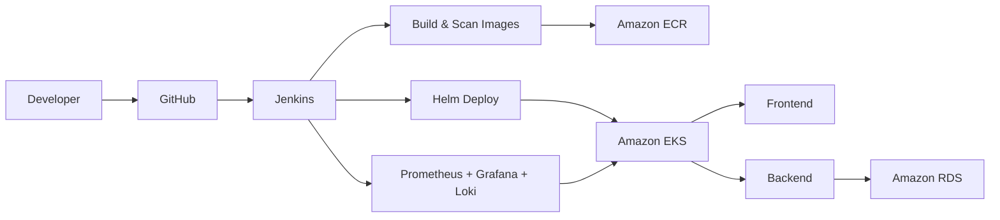

# NTI Final Project

A complete DevOps project that provisions AWS infrastructure, configures a Jenkins CI/CD pipeline, builds and scans container images, and deploys a web application to Amazon EKS using Helm.

This repository demonstrates a modern cloud-native workflow using Terraform, Ansible, Docker, Kubernetes/Helm, Jenkins, SonarQube, Trivy, and AWS services.

---

## Table of Contents

- [Quickstart](#quickstart)
- [Architecture](#architecture)
- [Repository Layout](#repository-layout)
- [Local Development](#local-development)
- [Provisioning (Terraform)](#provisioning-terraform)
- [Jenkins & Ansible Setup](#jenkins--ansible-setup)
- [CI/CD Pipeline (Jenkinsfile)](#cicd-pipeline-jenkinsfile)
- [Helm Deployment & Values](#helm-deployment--values)
- [Monitoring (Prometheus, Grafana & Loki)](#monitoring-prometheus-grafana--loki)
- [Troubleshooting](#troubleshooting)


---

## Quickstart

1. Provision infrastructure (AWS credentials required):

```bash
cd terraform
terraform init
terraform plan
terraform apply --auto-approve
```

2. Configure Jenkins host (update inventory with your Jenkins-ec2 IP and vault with your  AWS credentials):

```bash
ansible-playbook -i ansible/inventory.ini ansible/setup_jenkins_tools.yml
ansible-playbook -i ansible/inventory.ini ansible/jenkins.yml 
ansible-playbook -i ansible/inventory.ini ansible/sonarqube.yml
```
3. Configure SonarQube and Jenkins to Run the Multi-branch pipeline located in the `Jenkinsfile`.

3. Push code or trigger Jenkins job Manually.

4. After a successful run the Jenkins job prints the frontend ELB hostname in the build output, along with the Grafana URL and admin password.

---

## Architecture

High-level flow:



Key infrastructure provisioned by Terraform:

- VPC (public + private subnets)
- EKS cluster + nodegroups
- Jenkins EC2 instance
- Amazon RDS (MySQL)
- Amazon ECR repositories
- S3 bucket(s) for ELB access logs

---

## Repository Layout

Top-level folders and purpose:

```
ansible/    # playbooks to configure Jenkins host and tools
docker/     # local compose and image sources
helm/       # Helm chart (frontend, backend, services, secrets)
monitoring/ # Helm values overrides for Prometheus, Grafana & Loki
terraform/  # IaC for AWS resources and modules
Jenkinsfile # CI/CD pipeline definition
```

---

## Local Development

Quick local run using Docker Compose:

```bash
cd docker
docker compose up --build
```

Services:
- Frontend: http://localhost:8080
- Backend: http://localhost:5000
- MySQL: localhost:3306

---

## Provisioning (Terraform)

Initialize and apply the Terraform modules to create the AWS environment:

```bash
cd terraform
terraform init
terraform plan
terraform apply --auto-approve
```

Review `terraform/variables.tf` and `terraform/terraform.tfvars` before applying.

---

## Jenkins & Ansible Setup

1. Edit `ansible/inventory.ini` with your Jenkins host IP.
2. Add AWS secrets to `ansible/aws_secrets.yml` (use Ansible Vault for encryption).
3. Run the Ansible playbooks to install Docker, Jenkins container, kubectl, Helm, AWS CLI, SonarQube, and CloudWatch agent.

Example:

```bash
ansible-playbook -i ansible/inventory.ini ansible/setup_jenkins_tools.yml 
ansible-playbook -i ansible/inventory.ini ansible/jenkins.yml
```

The playbooks mount host binaries into the Jenkins container so Jenkins can run `docker`, `helm`, `kubectl`, and `aws` natively.

---

## CI/CD Pipeline (Jenkinsfile)

Stages (summary):

1. Checkout
2. SonarQube analysis
3. Build & Trivy scan images (frontend/backend)
4. Push images to Amazon ECR
5. Generate kubeconfig & fetch secrets
6. Deploy Helm chart to EKS
7. Deploy monitoring stack (Prometheus, Grafana & Loki) to EKS
8. Post-success: detect frontend ELB hostname, Grafana ELB hostname, and Grafana admin password, and print them in the build output

Notes:
- The pipeline uses `aws eks update-kubeconfig` to generate the kubeconfig file for Helm/kubectl.
- Image tags and DB credentials are injected into Helm at deploy time using `--set` flags.
- Dont forget to change your AWS_ACCOUNT_ID in the `Jenkinsfile`.

Manual commands used by pipeline (examples):

```bash
aws ecr get-login-password --region $AWS_REGION | docker login --username AWS --password-stdin $AWS_ACCOUNT_ID.dkr.ecr.$AWS_REGION.amazonaws.com
aws eks update-kubeconfig --region $AWS_REGION --name $CLUSTER_NAME --kubeconfig $WORKSPACE/kubeconfig.yaml
helm upgrade --install nti-release ./helm --kubeconfig $WORKSPACE/kubeconfig.yaml \
  --set frontend.image.repository=$FRONTEND_ECR --set frontend.image.tag=$BUILD_NUMBER \
  --set backend.image.repository=$BACKEND_ECR --set backend.image.tag=$BUILD_NUMBER \
  --set database.password=$DB_PASS --set database.host=$DB_HOST
```

---

## Helm Deployment & Values

- The chart lives under `helm/` and includes templates for frontend, backend, services, and secrets.
- Default values are in `helm/values.yaml` and are overridden by the pipeline.

Render or test the chart locally:

```bash
helm template nti-release ./helm --values helm/values.yaml
```

Install with overrides:

```bash
helm upgrade --install nti-release ./helm --set frontend.image.repository=... --set frontend.image.tag=... --set database.password=...
```

---

## Monitoring (Prometheus, Grafana & Loki)

- The monitoring stack is installed from the public `prometheus-community/kube-prometheus-stack` and `grafana/loki-stack` Helm repositories (not a local chart), configured with the values files under `monitoring/`.
- `monitoring/values-prometheus.yaml` configures Prometheus and Grafana, and registers Loki as a Grafana data source automatically via `additionalDataSources` 
- `monitoring/values-loki.yaml` configures Loki and Promtail (log collection agent).
- Grafana is exposed via a `LoadBalancer` service, the same mechanism already used for the app's frontend but it can be changed depending on your requirements.
- Prometheus, Alertmanager, and Loki remain internal (`ClusterIP`) and are never exposed to the internet.


The pipeline installs the monitoring stack automatically on every run:

```bash
helm upgrade --install kube-prometheus-stack prometheus-community/kube-prometheus-stack \
  --namespace monitoring \
  -f monitoring/values-prometheus.yaml \
  --wait --timeout 10m

helm upgrade --install loki-stack grafana/loki-stack \
  --namespace monitoring \
  -f monitoring/values-loki.yaml \
  --wait --timeout 10m
```

Get the Grafana admin password manually if needed:

```bash
kubectl get secret --namespace monitoring -l app.kubernetes.io/component=admin-secret -o jsonpath="{.items[0].data.admin-password}" | base64 --decode ; echo
```

The Grafana URL and admin password are also printed automatically at the end of every successful Jenkins build. `Testing environment not recommended on production`

---

## Troubleshooting

- Kubeconfig errors: ensure IAM credentials used by Jenkins have `eks:DescribeCluster` and related permissions.
- ECR push errors: ensure the ECR repository exists and the Jenkins host can authenticate.
- Helm timeouts: increase Helm/cluster timeouts or disable problematic webhooks for heavy charts.
- ELB not ready: AWS provisioning of LoadBalancers can take several minutes—check `kubectl get svc`.
- Monitoring pods stuck `Pending`: usually means the node(s) don't have enough CPU/memory headroom — check with `kubectl describe nodes | grep -A 8 "Allocated resources"`.


---